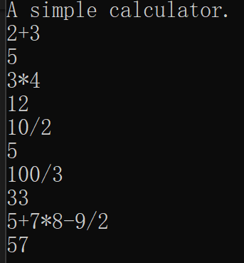

# 使用词法分析与语法分析实现简单四则运算计算器
## 实验环境
由于我的电脑是windows，因此使用词法分析器flex+语法分析器bison  
编译链接
```
flex  calc.l #生成C语言源代码
bison -o calc.tab.h calc.y  
gcc -o aa lex.yy.c calc.tab.h  //编译
```
* 需要单独下载flex+bison+gcc
## 实验代码
### 词法文件
>calc.l

* 定义一个flex输入文件，即添加运算符等描述词法
* 再用flex处理.l文件，生成对应的C语言源代码文件

代码分析  
* 第一部分：从 %{ 到 }% 标记的部分，这个部分会原封不动的复制到flex的生成代码中。
* 第二部分：从 % } 到 % % 之间的部分，这部分用正则表达式定义了一些数据类型。比如int num string ignore_char identifier等。 
* 第三部分：从% % 到% % 的部分，这里定义了词法分析器在解析的处理动作。

```
%option noyywrap

%{
    /*
     *  一个简单计算器的Lex词法文件
     */
	void yyerror(char*);
	#include "calc.tab.h"
%}

%%

     /* a-z为变量 */   
[a-z]	{
            yylval = *yytext - 'a';
            return VARIABLE;
    	}

    /* 整数 */
[0-9]+	{
            yylval = atoi(yytext);
            return INTEGER;
    	}

    /* 运算符 */
[-+()=/*\n]	{return *yytext;}

    /* 空白被忽略 */
[ \t]    ;

    /* 其他字符都是非法的 */
.    yyerror("无效的输入字符");

%%
```
### 语法文件
>calc.y

* 文法文件，定义左/右结合性，以及运算符优先级，符号优先级从上到下递增

代码分析
* 第一部分：% {和% }之间，是原封不动拷贝到输出的C语言源文件中的。 
* 第二部分:是%token INTEGER VARIABLE声明在flex中定义的那些TOKEN。
* 第三部分:是%% %%包围的部分,这部分就是语法的推导过程。可以比较轻松的看出，这部分主要就是采用BNF对语法进行描述。Bison能够完全支持LR(1)文法，即只要多向前看一个TOKEN，就能够决定如何解析。每一条规则的后面可以用{}来定义解析的动作，bison用$$表示规则左边的对象，用$1 $2 $3 等依次表示规则右边的对象。
```
%token    INTEGER VARIABLE
%left    '+' '-'
%left    '*' '/'

%{
	
/*for Visual studio */
/*	#define  __STDC__   0   */   

	#include <stdio.h>   
    void yyerror(char*);
    int yylex(void);
	
    int sym[26];
%}

%%
program:
    program statement '\n'
    |
    ;
statement:
     expr    {printf("%d\n", $1);}
     |VARIABLE '=' expr    {sym[$1] = $3;}
     ;
expr:
    INTEGER
    |VARIABLE{$$ = sym[$1];}
    |expr '+' expr    {$$ = $1 + $3;}
    |expr '-' expr    {$$ = $1 - $3;}
    |expr '*' expr    {$$ = $1 * $3;}
    |expr '/' expr    {$$ = $1 / $3;}
    |'('expr')'    {$$ = $2;}
    ;
	
%%

void yyerror(char* s)
{
    fprintf(stderr, "%s\n", s);
}

int main(void)
{
    printf("A simple calculator.\n");
    yyparse();
    return 0;
}
```
### 计算机工具
>aa.exe

效果如下图，只能进行简单的整数四则运算，如果出现不能识别的符号或错误的式子，比如'2++3'，直接退出程序
