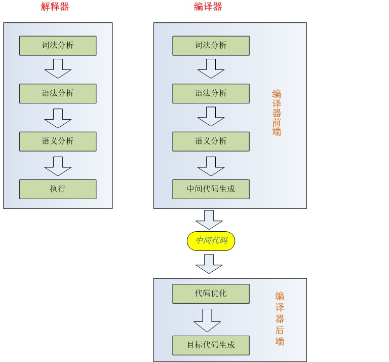
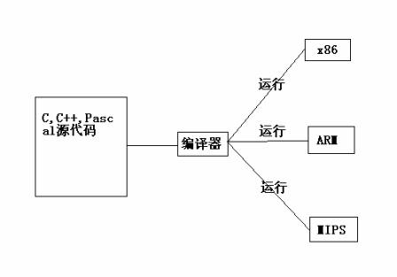
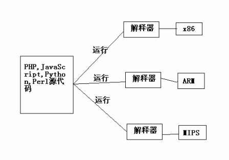

# C语言实现c语言编译器
输入.c文件生成汇编语言文件
## 实验环境
编辑器：virtual studio 16.4.1  
编译器：vs调试器自带的cl.exe  
连接器：vs调试器自带的link.exe
## 实现功能
1. 定义多个int和char类型的变量，并且能初始化。
2. 基本的加减乘除运算和带括号多变量的四则混合运算。
3. 注释，单行或多行。
4. 输出%c格式的字符、%d格式的一位或两位整数以及字符串。
5. 简单的条件语句，以大于和小于作为判断条件，没有实现逻辑运算符作为判断条件。
6. 部分错误语法可以报错。
## 实现思路
扫描源代码 --> 词法分析 --> 语法分析 -->中间代码 --> 目标代码（即汇编代码）
* 运行compiler有两种方式，第一种是使用virtual studio生成，调试运行后在'Debugger'目录下直接使用compiler.exe。但是这个是有调试信息可逆向的，所以还是听老师的话自己对编译链接
```
cl -c compiler.cpp  #看到生成了compiler.obj
link compiler.obg  #看到生成了compiler.exe
```
* 做ppt说明：实现代码步骤根据.cpp文件的主函数进行分析，注释很清晰。根据思路列出主要的函数说明实现了哪些功能，调用的处理函数有哪些实现了哪些功能即可。
## 实验效果
运行compiler.exe，.c文件都是测试代码文件，.asm都是相应生成的汇编代码文件
```
compiler.exe test1.c test1.asm
```
>test
## 实验收获
实验过程中，既是对编译原理的理解和实现，同时在查阅书籍文献等过程中，对一些底层的知识更加理解了，一定程度上串联了从前学习的《汇编语言》和《计算机组成原理》课程，对于学习有了一定的思考。
### 一、什么是编译器和解释器
实验过程中，发现为什么书上既有编译器又有解释器，原来不是一个东西。  
[下图来源](https://www.cnblogs.com/sword03/archive/2010/06/27/1766147.html)

由上图可以看到：解释器在语义分析后选择了直接执行语句；编译器在语义分析后选择将将语义存储成某一种中间语言，之后通过不同的后端翻译成不同的机器语言（可执行程序）。  
换句话说，编译器搞定后的代码在同种架构不同操作系统上的机器运行，而解释器则是同一种编程语言针对不同的CPU有不同的解释器，编程完成可以直接运行。以下的两幅图可以更好地解释。

  
举个例子：  
C和C++这两种语言都是编译型语言，编译型语言的特点是执行速度快，但不适合跨平台，比如我在windows中.c文件编译链接得到的exe是不能在Linux下运行的（因为windows的pe文件格式是exe，而linux得pe文件格式是elf）  
而像python这样的语言，在windows下python.exe执行.py，linux下/usr/bin/python或者其他elf格式的python解释器执行.py文件，因此可以跨平台。
#### 参考文献
[解释器和编译器的区别---儿子和女儿的例子，对比图特别好](https://www.cnblogs.com/sword03/archive/2010/06/27/1766147.html)  
[编译器和解释器的区别---牛吃草的例子特别好](https://blog.csdn.net/touzani/article/details/1625760)
### 二、关于底层的理解
完成此次实验，明白了很多以前不明白的东西。  
之前我们的实现都只是实现的编译器前端，这次实验需要实现编译器后端，首先熟悉当前系统的指令集（汇编语言）。根据我们熟悉的几种操作给出相应的汇编语言，因此得出了.cpp文件中比如'赋值运算'、'输出转换'、'if语句转换'等，根据操作符判断操作后能够直接输出汇编语言。  
* 因为不知道要如何去实现此次实验，查阅书籍，在《编译器构造（java版本）》中看到，作者是自己做了一个J1计算机，自己定义了指令集（比如对于一个16进制的二进制串保留前四位作为操作符，后十二位表示内存地址），自己生成了汇编器a、e进行汇编，在此基础上实现了编译器S1，解释器C11。明白了：我们现在的学习就是在学习前人发明创造规定的定义。
### 三、TCC
 或者叫Tiny C、TinyCC，是Fabrice Bellard 发明的 GNU/Linux 环境下最小的 ANSI C 语言编译器，其实功能的最终实现和vs差不多。有体积很小、可以使用任何GCC的源程序中可以使用的动态链接库等等优点  
 [IBM社区关于TCC的介绍](https://www.ibm.com/developerworks/cn/linux/l-tinyc/part1/index.html)  
 [Tiny CC 的主页](http://fabrice.bellard.free.fr/tcc/)
 * md中的参考文献请在ppt中以超链接方式列在底部
### 三、关于链接更深层的理解
链接器的作用是：把编写程序的目标代码（高级语言反汇编后的汇编代码）、系统的标准启动代码（进入C的main函数之前需执行的汇编代码）和库代码合并在一起称为可执行文件
* 启动代码：对系统硬件及软件环境进行必要的初始化并在最后使程序跳转到用户程序，C语言程序的运行需要具备一定的条件，如分配好外部数据空间、设置初始堆栈指针、配置时钟、设置中断向量入口、设置初始程序计数器（指向main()）等。另外，汇编代码可以更直接地对硬件进行操作，效率更高，这对启动中断等对时间要求更高的情况是非常必要的，这也是为什么我们设置基址可以更改反汇编以后的起始地址


